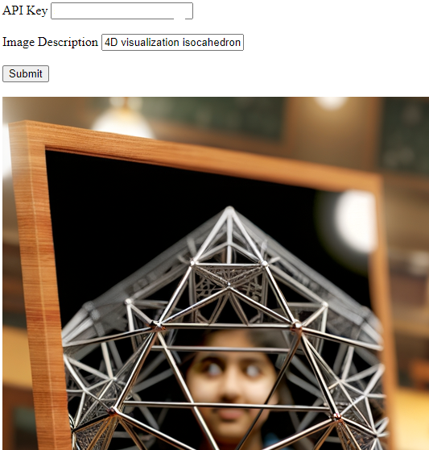

# Frontend client for image generation with OpenAI 

### Background
The [OpenAI API](https://platform.openai.com/docs/api-reference/making-requests) has demos for different clients, including node.js. However, this is a <i>backend</i> javascript client.
A <i>frontend</i> Javascript client, as implemented here, should be able to call the OpenAI API endpoints directly.

### Execution
1. Get an API-key from OpenAI [here](https://platform.openai.com/api-keys).
2. Double-click on the file [openai-client.html](./openai-client.html) (or open it with your browser of choice). No server is needed.
3. Enter your API-key (once) and enter a description for the tobe generated image (as many times as you like and with the speed that the OpenAI API allows). Note that it can take some time (roughly 10-20 seconds) to receive the image.
4. Check out the developer console upon errors (no rendering of new images).

### Snapshot of the UI
  

### UI Features
- Interactive calls of the OpenAI API for the generation of an image
- Rendering the generated image

### Code Features
- 100% class-based and 100% functional
  - Classes with static methods and no fields
- No global variables
- Promise-based
- Separation of concerns with the following classes
  - DomController
  - RestController
  - OpenaiApi
  - OpenaiBrowserClient
  - App
- Creating and rendering multiple images with a single HTTP call
  - The default value of 1 (for the number of images) can be changed without changing the logic.
- Many user-defined parameters (the class OpenaiApi)
  - Possibility of defining more UI elements for more control

### Examples of outputs
- Copyright: [Notes from OpenAI regarding image copyrights](https://help.openai.com/en/articles/6425277-can-i-sell-images-i-create-with-dall-e)

- 'Drinking tea and watching rain outside through the window'

- 'dancing bare-foor happily alone in the rain at night'

- '4D visualization isocahedron girl  reflection'

- 'girl and icosahedron and projection'

